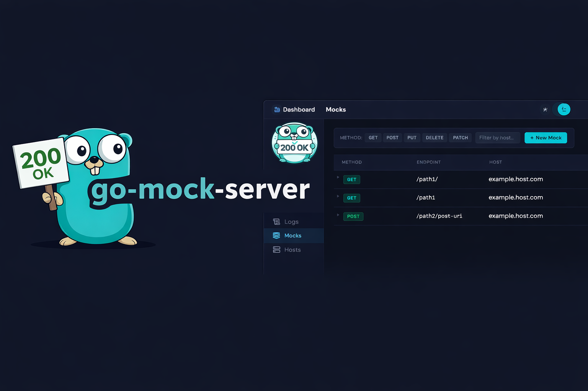
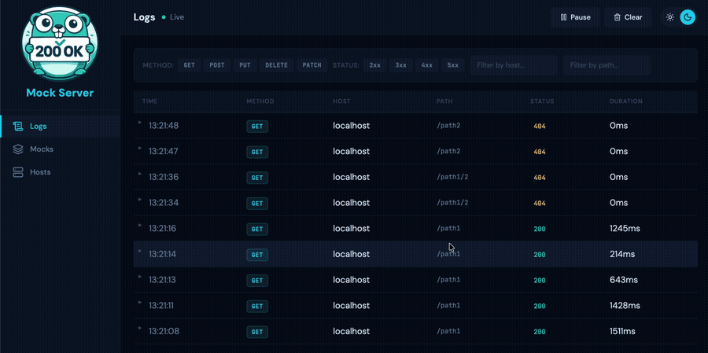

# Go Mock Server

[](https://github.com/Caik/go-mock-server/actions/workflows/build.yml)
[](https://github.com/Caik/go-mock-server/releases/latest)
[](https://goreportcard.com/report/github.com/Caik/go-mock-server)
[](https://codecov.io/github/Caik/go-mock-server)

**Go Mock Server** is a lightweight HTTP mock server built in Go. Run it locally, point your app at it, and control every response — no real API needed.

Ever found yourself waiting for a backend that isn't ready? Dealing with flaky third-party services in CI? Trying to reproduce a rate-limit or 503 error that only happens in production? Go Mock Server solves all of that: define your mock responses as plain files, start the server, and your app has a fully controllable API to talk to — complete with a web UI for managing everything in real time.

## Contents

- [Quick Start](#-quick-start)
- [How It Works](#-how-it-works)
- [Installation](#-installation)
  - [Docker](#1-docker)
  - [Pre-compiled Binaries](#2-pre-compiled-binaries)
  - [Compiling Your Own Binary](#3-compiling-your-own-binary)
- [Creating Mocks](#-creating-mocks)
  - [Mock Files](#a-mock-files)
  - [Dynamic Creation via API](#b-dynamic-creation-via-api)
- [Simulate Latency and Status Codes](#-simulate-latency-and-status-codes)
  - [Latency Simulation](#latency-simulation)
  - [Status Code Simulation](#status-code-simulation)
- [Integrate with Your Application](#-integrate-with-your-application)
- [Admin UI](#%EF%B8%8F-admin-ui)
- [Command-Line Options](#-command-line-options)
- [Want to Contribute?](#-want-to-contribute)
- [License](#%EF%B8%8F-license)

<br />

## ⚡ Quick Start

Get a mock server running in under a minute:

**1. Start the server:**
```bash
docker run --name mock-server --rm \
  -p 8080:8080 -p 9090:9090 \
  -v $(pwd)/my-mocks:/mocks \
  caik/go-mock-server:latest \
  --mocks-directory /mocks \
  --ui-dir /app/ui
```

**2. Create your first mock:**
```bash
mkdir -p my-mocks/localhost:8080/api/v1
echo '{"message": "hello from mock"}' > my-mocks/localhost:8080/api/v1/hello.get.200
```

**3. Call it:**
```bash
curl http://localhost:8080/api/v1/hello
# {"message": "hello from mock"}
```

Open **http://localhost:9090/ui/** to browse and manage your mocks visually.

> **No Docker?** Download a [pre-compiled binary](https://github.com/Caik/go-mock-server/releases) and run:
> ```bash
> ./mock-server --mocks-directory ./my-mocks
> ```

<br />

## 🔍 How It Works

Go Mock Server runs two servers simultaneously:

- **Port 8080** — the mock server. Your application points here instead of the real API.
- **Port 9090** — the admin server. Hosts the REST API and the web UI.

### Request Routing

When a request arrives at port 8080, Go Mock Server resolves it to a file on disk using this pattern:

```
{mocks-directory}/{host}/{uri}.{method}.{status-code}
```

**Example:** A `GET` request to `http://localhost:8080/api/v1/hello` with `Host: example.host.com` resolves to:

```
my-mocks/example.host.com/api/v1/hello.get.200
```

The file's contents become the response body, and the status code in the filename is returned as the HTTP status.

### Filename Anatomy

| Part | Example | Description |
|------|---------|-------------|
| Host directory | `example.host.com/` | Matches the `Host` request header |
| URI path | `api/v1/hello` | Maps directly to the request path |
| Method | `.get` | HTTP method, lowercase |
| Status code | `.200` | The HTTP status code returned |

More examples:

```
my-mocks/
└── example.host.com/
    ├── api/v1/users.get.200       # GET /api/v1/users → 200
    ├── api/v1/users.post.201      # POST /api/v1/users → 201
    ├── api/v1/users.get.404       # GET /api/v1/users → 404 (used by status simulation)
    └── _default.get.200           # fallback for any unmatched GET → 200
```

### Fallback: `_default`

Place a `_default.{method}.{status-code}` file in any host directory to catch requests that don't match a specific URI. The status code is part of the filename — `_default.get.200` only fires for unmatched GETs when a 200 is expected. If you're using status simulation that injects 404s, you'd also want a `_default.get.404` to provide the response body for those injected errors. Useful during early development when you want the server to always respond rather than return an error.

### Hot Reload

Mock files are watched automatically. Create, update, or delete a file and Go Mock Server picks up the change immediately — no restart required.

<br />

## 💿 Installation

### 1. Docker

The easiest way to run Go Mock Server. The Docker image includes the pre-built admin UI at `/app/ui`.

```bash
docker run --name mock-server --rm \
  -p 8080:8080 -p 9090:9090 \
  -v $(pwd)/my-mocks:/mocks \
  caik/go-mock-server:latest \
  --mocks-directory /mocks \
  --ui-dir /app/ui
```

Omit the `-v` volume mount if you want to start with no pre-existing mocks and create them all via the API or UI.

### 2. Pre-compiled Binaries

Download a binary for your platform from the **[Releases](https://github.com/Caik/go-mock-server/releases)** page. Available for Linux, macOS (AMD64 and ARM64), and Windows.

```bash
# macOS / Linux: make executable first
chmod +x ./mock-server

./mock-server --mocks-directory ./my-mocks
```

### 3. Compiling Your Own Binary

Requires Go installed on your machine.

```bash
# Example: build a macOS AMD64 binary
CGO_ENABLED=0 GOOS=darwin GOARCH=amd64 \
  go build -a -ldflags '-extldflags "-static" -s -w' \
  -o ./mock-server-darwin-amd64 \
  cmd/mock-server/main.go
```

<br />

## 📝 Creating Mocks

### a) Mock Files

Create a file inside `--mocks-directory` following the naming convention described in [How It Works](#-how-it-works). The file contents become the response body.

```bash
# GET example.host.com/api/v1/users → 200 with JSON body
mkdir -p my-mocks/example.host.com/api/v1
echo '[{"id": 1, "name": "Alice"}]' > my-mocks/example.host.com/api/v1/users.get.200

# POST example.host.com/api/v1/users → 201
echo '{"id": 2, "name": "Bob"}' > my-mocks/example.host.com/api/v1/users.post.201
```

Changes are picked up automatically — no restart needed.

### b) Dynamic Creation via API

Use the admin API to create, update, or delete mocks at runtime. Useful in CI pipelines or when you want to automate mock setup.

**Create a mock:**
```bash
curl -X POST \
  -H "x-mock-host: example.host.com" \
  -H "x-mock-uri: /api/v1/users" \
  -H "x-mock-method: GET" \
  -H "x-mock-status: 200" \
  --data-raw '[{"id": 1, "name": "Alice"}]' \
  http://localhost:9090/api/v1/mocks
```

**Delete a mock:**
```bash
curl -X DELETE \
  -H "x-mock-host: example.host.com" \
  -H "x-mock-uri: /api/v1/users" \
  -H "x-mock-method: GET" \
  -H "x-mock-status: 200" \
  http://localhost:9090/api/v1/mocks
```

For the full list of API endpoints, see the [Swagger documentation](https://github.com/Caik/go-mock-server/blob/main/docs/swagger.json).

<br />

## ⚙️ Simulate Latency and Status Codes

These features let you test how your application behaves under adverse conditions — slow responses, intermittent errors, or sustained failure rates — without touching the real API.

### Latency Simulation

Configure per-host latency using a percentile distribution. This lets you model realistic network conditions rather than a flat delay.

```bash
curl -X POST \
  -H "Content-Type: application/json" \
  -d '{
    "latency": {
      "min": 100,
      "p95": 1800,
      "p99": 1900,
      "max": 2000
    }
  }' \
  http://localhost:9090/api/v1/config/hosts/example.host.com/latencies
```

| Field | Meaning |
|-------|---------|
| `min` | Minimum delay in milliseconds — every request waits at least this long |
| `p95` | 95% of requests complete within this many milliseconds |
| `p99` | 99% of requests complete within this many milliseconds |
| `max` | Hard ceiling — no request waits longer than this |

To remove latency simulation for a host, send a `DELETE` to the same endpoint.

### Status Code Simulation

Inject non-200 responses at a configurable rate. Useful for testing error handling and retry logic.

```bash
curl -X POST \
  -H "Content-Type: application/json" \
  -d '{
    "statuses": {
      "500": {"percentage": 10},
      "503": {"percentage": 5}
    }
  }' \
  http://localhost:9090/api/v1/config/hosts/example.host.com/statuses
```

In this example, for requests to `example.host.com`:
- **10%** receive a `500 Internal Server Error`
- **5%** receive a `503 Service Unavailable`
- **85%** receive the normal mock response

Multiple status codes can be combined as long as the total percentage does not exceed 100%. Go Mock Server needs a corresponding mock file for each status code you inject (e.g. `api/v1/users.get.500`) to serve as the response body for that error.

To remove a specific status simulation:
```bash
curl -X DELETE http://localhost:9090/api/v1/config/hosts/example.host.com/statuses/500
```

For the full API reference, see the [Swagger documentation](https://github.com/Caik/go-mock-server/blob/main/docs/swagger.json).

<br />

## 🔗 Integrate with Your Application

Point your application's API base URL at the mock server instead of the real API:

```
Before: https://example.host.com/api/v1/users
After:  http://localhost:8080/api/v1/users
```

Go Mock Server uses the `Host` header to determine which host directory to look in. When you change the base URL, the `Host` header automatically becomes `localhost:8080`, so Go Mock Server looks for mocks under a `localhost:8080/` directory.

**To keep your host directory name meaningful** (e.g. `example.host.com/`), pass the original hostname as a `Host` header in your requests, or configure your application to send it explicitly.

Alternatively, just name your mock directory `localhost:8080/` — it works exactly the same way.

```bash
# These two are equivalent:
curl http://localhost:8080/api/v1/users
# → looks in: my-mocks/localhost:8080/api/v1/users.get.200

curl -H "Host: example.host.com" http://localhost:8080/api/v1/users
# → looks in: my-mocks/example.host.com/api/v1/users.get.200
```

<br />

## 🖥️ Admin UI



Go Mock Server ships with a fully-featured web UI, available at **http://localhost:9090/ui/** (requires `--ui-dir /app/ui` when using Docker, or `--ui-dir ./web/build/client` when running from source).

From the UI you can:

- **Manage mocks** — create, edit, and delete mock definitions. Changes take effect immediately, no restart required.
- **Control host behaviour** — configure per-host latency ranges and error injection rates without writing a single curl command.
- **Watch live traffic** — the Logs page streams every request in real time. Filter by method, status code, host, or path to debug routing issues and validate your integration.

**Bring your own UI:** The `--ui-dir` flag accepts any directory. Build a custom admin interface and point `--ui-dir` at its output folder — Go Mock Server will serve it with full SPA routing support.

<br />

## 🛠️ Command-Line Options

| Option | Default | Description |
|--------|---------|-------------|
| `--mocks-directory` | *(required)* | Path to the directory containing mock files |
| `--port` | `8080` | Port for the mock server |
| `--admin-port` | `9090` | Port for the admin API and UI (set to `0` to disable) |
| `--ui-dir` | *(none)* | Path to the web UI directory to serve at `/ui/`. The Docker image ships with the UI at `/app/ui`. |
| `--mocks-config-file` | *(none)* | Path to an additional config file |
| `--default-content-type` | `text/plain` | Default `Content-Type` for responses when none is specified |
| `--traffic-log-buffer-size` | `1000` | Number of recent requests to keep in the in-memory traffic log (set to `0` to disable) |
| `--disable-cache` | `false` | Disable in-memory response caching |
| `--disable-latency` | `false` | Disable latency simulation |
| `--disable-cors` | `false` | Disable automatic CORS headers |

**Examples:**

```bash
# Run on a custom port with caching disabled
./mock-server --mocks-directory ./my-mocks --port 9080 --disable-cache

# Run with the admin UI enabled (binary build)
./mock-server --mocks-directory ./my-mocks --ui-dir ./web/build/client

# Run with CORS disabled (e.g. server-to-server testing)
./mock-server --mocks-directory ./my-mocks --disable-cors
```

<br />

## 🔧 Want to Contribute?

Contributions are welcome! Please review the [contribution guidelines](https://github.com/Caik/go-mock-server/blob/main/CONTRIBUTING.md) before opening a PR.

<br />

## ⚖️ License

[](https://github.com/Caik/go-mock-server/blob/main/LICENSE)

Released 2023 by [Carlos Henrique Severino](https://github.com/Caik)
